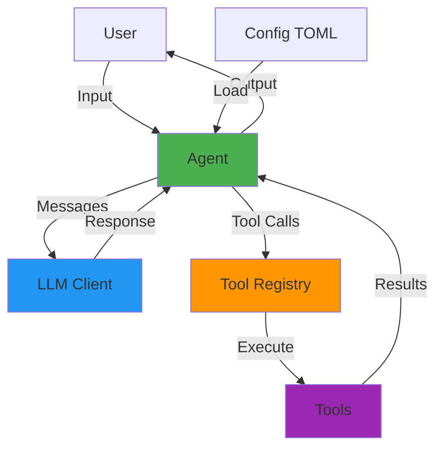
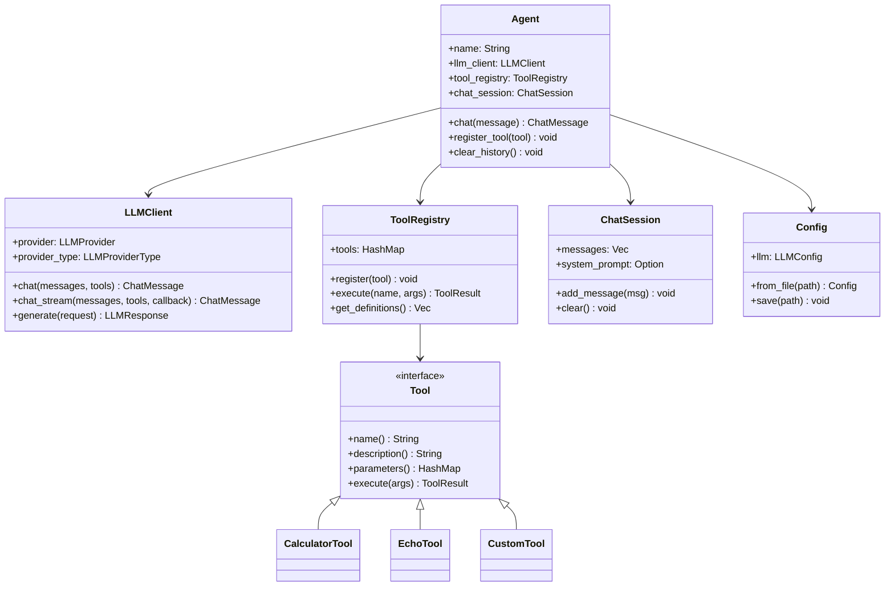
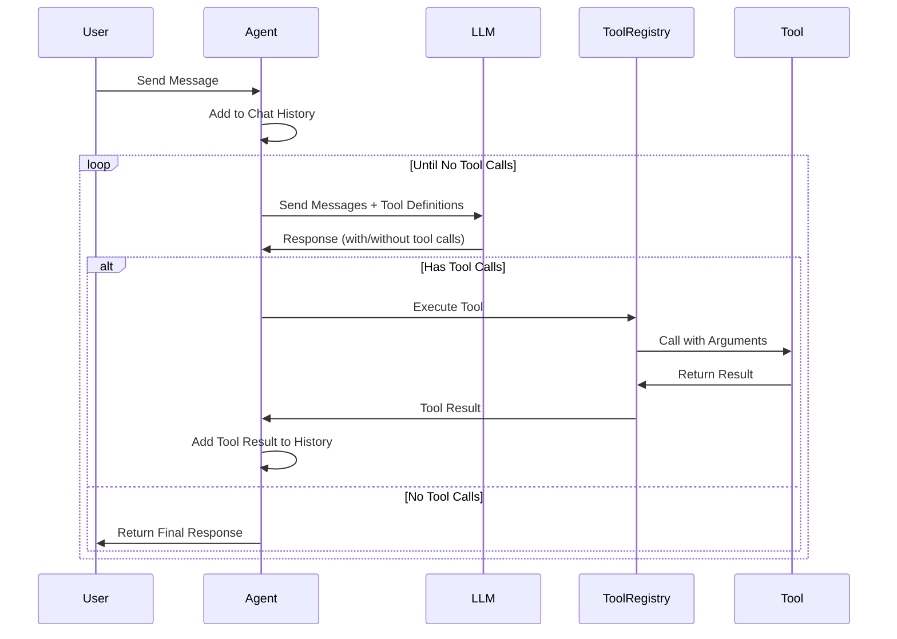
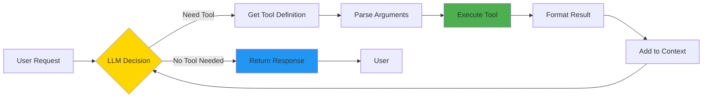

# 🔥 Helios Engine - LLM Agent Framework

<p align="center">
  
</p>

[](https://crates.io/crates/helios-engine)


[](https://docs.rs/helios-engine)
[](https://crates.io/crates/helios-engine)


[](https://github.com/Ammar-Alnagar/Helios-Engine/issues)
[](https://github.com/Ammar-Alnagar/Helios-Engine/stargazers)
[](https://github.com/Ammar-Alnagar/Helios-Engine/commits/main)


**Helios Engine** is a powerful and flexible Rust framework for building LLM-powered agents with tool support, streaming chat capabilities, and easy configuration management. Create intelligent agents that can interact with users, call tools, and maintain conversation context - with both online and offline local model support.

##  Features

-  **Agent System**: Create multiple agents with different personalities and capabilities
-   **Tool Registry**: Extensible tool system for adding custom functionality
-  **Chat Management**: Built-in conversation history and session management
-  **Session Memory**: Track agent state and metadata across conversations
-  **File Management Tools**: Built-in tools for searching, reading, writing, and editing files
-  **Streaming Support**: Real-time response streaming for both remote and local models
-  **Local Model Support**: Run local models offline using llama.cpp with HuggingFace integration
-  **LLM Support**: Compatible with OpenAI API, any OpenAI-compatible API, and local models
-  **Async/Await**: Built on Tokio for high-performance async operations
-  **Type-Safe**: Leverages Rust's type system for safe and reliable code
-  **Extensible**: Easy to add custom tools and extend functionality
-  **Thinking Tags**: Automatic detection and display of model reasoning process
-  **Dual Mode Support**: Auto, online (remote API), and offline (local) modes
-  **Clean Output**: Suppresses verbose debugging in offline mode for clean user experience
-  **CLI & Library**: Use as both a command-line tool and a Rust library crate

##  Table of Contents

- [Installation](#installation)
- [Quick Start](#quick-start)
  - [Using as a Library Crate](#using-as-a-library-crate)
  - [Using Offline Mode with Local Models](#using-offline-mode-with-local-models)
  - [Using with Agent System](#using-with-agent-system)
- [CLI Usage](#cli-usage)
- [Configuration](#configuration)
- [Local Inference Setup](#local-inference-setup)
- [Architecture](#architecture)
- [Usage Examples](#usage-examples)
- [Creating Custom Tools](#creating-custom-tools)
- [API Documentation](#api-documentation)
- [Project Structure](#project-structure)
- [Examples](#examples)
- [Contributing](#contributing)
- [License](#license)

##  Installation

Helios Engine can be used both as a **command-line tool** and as a **library crate** in your Rust projects.

### As a CLI Tool (Recommended for Quick Start)

Install globally using Cargo (once published):

```bash
cargo install helios-engine
```

Then use anywhere:

```bash
# Initialize configuration
helios-engine init

# Start interactive chat (default command)
helios-engine
# or explicitly
helios-engine chat

# Ask a quick question
helios-engine ask "What is Rust?"

# Get help
helios-engine --help

#  NEW: Use offline mode with local models (no internet required)
helios-engine --mode offline chat

# Use online mode (forces remote API usage)
helios-engine --mode online chat

# Auto mode (uses local if configured, otherwise remote)
helios-engine --mode auto chat

# Verbose logging for debugging
helios-engine --verbose chat

# Custom system prompt
helios-engine chat --system-prompt "You are a Python expert"

# One-off question with custom config
helios-engine --config /path/to/config.toml ask "Calculate 15 * 7"
```

### As a Library Crate

Add Helios-Engine to your `Cargo.toml`:

```toml
[dependencies]
helios-engine = "0.2.5"
tokio = { version = "1.35", features = ["full"] }
```

Or use a local path during development:

```toml
[dependencies]
helios-engine = { path = "../helios" }
tokio = { version = "1.35", features = ["full"] }
```

### Build from Source

```bash
git clone https://github.com/Ammar-Alnagar/Helios-Engine.git
cd Helios-Engine
cargo build --release

# Install locally
cargo install --path .
```

##  Quick Start

### Using as a Library Crate

The simplest way to use Helios Engine is to call LLM models directly:

```rust
use helios_engine::{LLMClient, ChatMessage, llm::LLMProviderType};
use helios_engine::config::LLMConfig;

#[tokio::main]
async fn main() -> helios_engine::Result<()> {
    // Configure the LLM
    let llm_config = LLMConfig {
        model_name: "gpt-3.5-turbo".to_string(),
        base_url: "https://api.openai.com/v1".to_string(),
        api_key: std::env::var("OPENAI_API_KEY").unwrap(),
        temperature: 0.7,
        max_tokens: 2048,
    };

    // Create client with remote provider type
    let client = LLMClient::new(LLMProviderType::Remote(llm_config)).await?;

    // Make a call
    let messages = vec![
        ChatMessage::system("You are a helpful assistant."),
        ChatMessage::user("What is the capital of France?"),
    ];

    let response = client.chat(messages, None).await?;
    println!("Response: {}", response.content);

    Ok(())
}
```

**For detailed examples of using Helios Engine as a crate, see [Using as a Crate Guide](docs/USING_AS_CRATE.md)**

### Using Offline Mode with Local Models

Run models locally without internet connection:

```rust
use helios_engine::{LLMClient, ChatMessage, llm::LLMProviderType};
use helios_engine::config::LocalConfig;

#[tokio::main]
async fn main() -> helios_engine::Result<()> {
    // Configure local model
    let local_config = LocalConfig {
        huggingface_repo: "unsloth/Qwen3-0.6B-GGUF".to_string(),
        model_file: "Qwen3-0.6B-Q4_K_M.gguf".to_string(),
        temperature: 0.7,
        max_tokens: 2048,
    };

    // Create client with local provider
    let client = LLMClient::new(LLMProviderType::Local(local_config)).await?;

    let messages = vec![
        ChatMessage::system("You are a helpful AI assistant."),
        ChatMessage::user("What is Rust programming?"),
    ];

    let response = client.chat(messages, None).await?;
    println!("Response: {}", response.content);

    Ok(())
}
```

**Note**: First run downloads the model. Subsequent runs use the cached model.

### Using with Agent System

For more advanced use cases with tools and persistent conversation:

#### 1. Configure Your LLM

Create a `config.toml` file (supports both remote and local):

```toml
[llm]
model_name = "gpt-3.5-turbo"
base_url = "https://api.openai.com/v1"
api_key = "your-api-key-here"
temperature = 0.7
max_tokens = 2048

# Optional: Add local configuration for offline mode
[local]
huggingface_repo = "unsloth/Qwen3-0.6B-GGUF"
model_file = "Qwen3-0.6B-Q4_K_M.gguf"
temperature = 0.7
max_tokens = 2048
```

#### 2. Create Your First Agent

```rust
use helios_engine::{Agent, Config, CalculatorTool};

#[tokio::main]
async fn main() -> helios_engine::Result<()> {
    // Load configuration
    let config = Config::from_file("config.toml")?;

    // Create an agent with tools
    let mut agent = Agent::builder("HeliosAgent")
        .config(config)
        .system_prompt("You are a helpful AI assistant.")
        .tool(Box::new(CalculatorTool))
        .build()
        .await?;

    // Chat with the agent
    let response = agent.chat("What is 15 * 7?").await?;
    println!("Agent: {}", response);

    Ok(())
}
```

#### 3. Run the Interactive Demo

```bash
cargo run
```

##  CLI Usage

Helios Engine provides a powerful command-line interface with multiple modes and options:

### Interactive Chat Mode
Start an interactive chat session:
```bash
# Default chat session
helios-engine

# With custom system prompt
helios-engine chat --system-prompt "You are a helpful coding assistant"

# With custom max iterations for tool calls
helios-engine chat --max-iterations 10

# With verbose logging for debugging
helios-engine --verbose chat
```

### One-off Questions
Ask a single question without interactive mode:
```bash
# Ask a single question
helios-engine ask "What is the capital of France?"

# Ask with custom config file
helios-engine --config /path/to/config.toml ask "Calculate 123 * 456"
```

### Configuration Management
Initialize and manage configuration:
```bash
# Create a new configuration file
helios-engine init

# Create config in custom location
helios-engine init --output ~/.helios/config.toml
```

### Mode Selection
Choose between different operation modes:
```bash
# Auto mode (uses local if configured, otherwise remote API)
helios-engine --mode auto chat

# Online mode (forces remote API usage)
helios-engine --mode online chat

# Offline mode (uses local models only)
helios-engine --mode offline chat
```

### Interactive Commands
During an interactive session, use these commands:
- `exit` or `quit` - Exit the chat session
- `clear` - Clear conversation history
- `history` - Show conversation history
- `help` - Show help message

##  Configuration

Helios Engine uses TOML for configuration. You can configure either remote API access or local model inference with the dual LLMProviderType system.

### Remote API Configuration (Default)

```toml
[llm]
# The model name (e.g., gpt-3.5-turbo, gpt-4, claude-3, etc.)
model_name = "gpt-3.5-turbo"

# Base URL for the API (OpenAI or compatible)
base_url = "https://api.openai.com/v1"

# Your API key
api_key = "your-api-key-here"

# Temperature for response generation (0.0 - 2.0)
temperature = 0.7

# Maximum tokens in response
max_tokens = 2048
```

### Local Model Configuration (Offline Mode with llama.cpp)

```toml
[llm]
# Remote config still needed for auto mode fallback
model_name = "gpt-3.5-turbo"
base_url = "https://api.openai.com/v1"
api_key = "your-api-key-here"
temperature = 0.7
max_tokens = 2048

# Local model configuration for offline mode
[local]
# HuggingFace repository and model file
huggingface_repo = "unsloth/Qwen3-0.6B-GGUF"
model_file = "Qwen3-0.6B-Q4_K_M.gguf"

# Local model settings
temperature = 0.7
max_tokens = 2048
```

### Auto Mode Configuration (Remote + Local)

For maximum flexibility, configure both remote and local models to enable auto mode:

```toml
[llm]
model_name = "gpt-3.5-turbo"
base_url = "https://api.openai.com/v1"
api_key = "your-api-key-here"
temperature = 0.7
max_tokens = 2048

# Local model as fallback
[local]
huggingface_repo = "unsloth/Qwen3-0.6B-GGUF"
model_file = "Qwen3-0.6B-Q4_K_M.gguf"
temperature = 0.7
max_tokens = 2048
```

### Supported LLM Providers

Helios Engine supports both remote APIs and local model inference:

#### Remote APIs (Online Mode)
Helios Engine works with any OpenAI-compatible API:

- **OpenAI**: `https://api.openai.com/v1`
- **Azure OpenAI**: `https://your-resource.openai.azure.com/openai/deployments/your-deployment`
- **Local Models (LM Studio)**: `http://localhost:1234/v1`
- **Ollama with OpenAI compatibility**: `http://localhost:11434/v1`
- **Any OpenAI-compatible API**

#### Local Models (Offline Mode)
Run models locally using llama.cpp without internet connection:

- **GGUF Models**: Compatible with all GGUF format models from HuggingFace
- **Automatic Download**: Models are downloaded automatically from HuggingFace
- **GPU Acceleration**: Uses GPU if available (via llama.cpp)
- **Clean Output**: Suppresses verbose debugging for clean user experience
- **Popular Models**: Works with Qwen, Llama, Mistral, and other GGUF models

**Supported Model Sources:**
- HuggingFace Hub repositories
- Local GGUF files
- Automatic model caching

##  Local Inference Setup

Helios Engine supports running large language models locally using llama.cpp through the LLMProviderType system, providing privacy, offline capability, and no API costs.

### Prerequisites

- **HuggingFace Account**: Sign up at [huggingface.co](https://huggingface.co) (free)
- **HuggingFace CLI**: Install the CLI tool:
  ```bash
  pip install huggingface_hub
  huggingface-cli login  # Login with your token
  ```

### Setting Up Local Models

1. **Find a GGUF Model**: Browse [HuggingFace Models](https://huggingface.co/models?library=gguf) for compatible models

2. **Update Configuration**: Add local model config to your `config.toml`:
   ```toml
   [local]
   huggingface_repo = "unsloth/Qwen3-0.6B-GGUF"
   model_file = "Qwen3-0.6B-Q4_K_M.gguf"
   temperature = 0.7
   max_tokens = 2048
   ```

3. **Run in Offline Mode**:
   ```bash
   # First run downloads the model
   helios-engine --mode offline ask "Hello world"

   # Subsequent runs use cached model
   helios-engine --mode offline chat
   ```

### Recommended Models

| Model | Size | Use Case | Repository |
|-------|------|----------|------------|
| Qwen3-0.6B | ~400MB | Fast, good quality | `unsloth/Qwen3-0.6B-GGUF` |
| Llama-3.2-1B | ~700MB | Balanced performance | `unsloth/Llama-3.2-1B-Instruct-GGUF` |
| Mistral-7B | ~4GB | High quality | `TheBloke/Mistral-7B-Instruct-v0.1-GGUF` |

### Performance & Features

- **GPU Acceleration**: Models automatically use GPU if available via llama.cpp's n_gpu_layers parameter
- **Model Caching**: Downloaded models are cached locally (~/.cache/huggingface)
- **Memory Usage**: Larger models need more RAM/VRAM
- **First Run**: Initial model download may take time depending on connection
- **Clean Output Mode**: Suppresses verbose debugging from llama.cpp for clean user experience

### Streaming Support with Local Models

Local models now support real-time token-by-token streaming just like remote models! The LLMClient automatically handles streaming for both remote and local models through the same unified API, providing a consistent experience.

##  Architecture

### System Overview



### Component Architecture



### Agent Execution Flow



### Tool Execution Pipeline



##  Usage Examples

### Basic Chat

```rust
use helios_engine::{Agent, Config};

#[tokio::main]
async fn main() -> helios_engine::Result<()> {
    let config = Config::from_file("config.toml")?;

    let mut agent = Agent::builder("Assistant")
        .config(config)
        .system_prompt("You are a helpful assistant.")
        .build()
        .await?;

    let response = agent.chat("Hello!").await?;
    println!("{}", response);

    Ok(())
}
```

### Agent with Built-in Tools

```rust
use helios_engine::{Agent, Config, CalculatorTool, EchoTool};

#[tokio::main]
async fn main() -> helios_engine::Result<()> {
    let config = Config::from_file("config.toml")?;

    let mut agent = Agent::builder("ToolAgent")
        .config(config)
        .system_prompt("You have access to tools. Use them wisely.")
        .tool(Box::new(CalculatorTool))
        .tool(Box::new(EchoTool))
        .max_iterations(5)
        .build()
        .await?;

    // The agent will automatically use the calculator
    let response = agent.chat("What is 123 * 456?").await?;
    println!("{}", response);

    Ok(())
}
```

### Multiple Agents

```rust
use helios_engine::{Agent, Config};

#[tokio::main]
async fn main() -> helios_engine::Result<()> {
    let config = Config::from_file("config.toml")?;

    let mut poet = Agent::builder("Poet")
        .config(config.clone())
        .system_prompt("You are a creative poet.")
        .build()
        .await?;

    let mut scientist = Agent::builder("Scientist")
        .config(config)
        .system_prompt("You are a knowledgeable scientist.")
        .build()
        .await?;

    let poem = poet.chat("Write a haiku about code").await?;
    let fact = scientist.chat("Explain quantum physics").await?;

    println!("Poet: {}\n", poem);
    println!("Scientist: {}", fact);

    Ok(())
}
```

### Agent with File Tools and Session Memory

Agents can use file management tools and track session state:

```rust
use helios_engine::{Agent, Config, FileSearchTool, FileReadTool, FileWriteTool, FileEditTool};

#[tokio::main]
async fn main() -> helios_engine::Result<()> {
    let config = Config::from_file("config.toml")?;

    let mut agent = Agent::builder("FileAssistant")
        .config(config)
        .system_prompt("You are a helpful file management assistant.")
        .tool(Box::new(FileSearchTool))
        .tool(Box::new(FileReadTool))
        .tool(Box::new(FileWriteTool))
        .tool(Box::new(FileEditTool))
        .build()
        .await?;

    // Set session memory
    agent.set_memory("session_start", chrono::Utc::now().to_rfc3339());
    agent.set_memory("working_directory", std::env::current_dir()?.display().to_string());

    // Use file tools
    let response = agent.chat("Find all Rust files in the src directory").await?;
    println!("Agent: {}\n", response);

    // Track tasks
    agent.increment_tasks_completed();

    // Get session summary
    println!("{}", agent.get_session_summary());

    Ok(())
}
```

### Streaming Chat (Direct LLM Usage)

Use streaming to receive responses in real-time:

```rust
use helios_engine::{LLMClient, ChatMessage, llm::LLMProviderType};
use helios_engine::config::LLMConfig;

#[tokio::main]
async fn main() -> helios_engine::Result<()> {
    let llm_config = LLMConfig {
        model_name: "gpt-3.5-turbo".to_string(),
        base_url: "https://api.openai.com/v1".to_string(),
        api_key: std::env::var("OPENAI_API_KEY").unwrap(),
        temperature: 0.7,
        max_tokens: 2048,
    };

    // Create client with remote provider type (streaming enabled)
    let client = LLMClient::new(LLMProviderType::Remote(llm_config)).await?;

    let messages = vec![
        ChatMessage::system("You are a helpful assistant that responds concisely."),
        ChatMessage::user("Write a short poem about programming."),
    ];

    println!("🤖: ");
    let response = client
        .chat_stream(messages, None, |chunk| {
            print!("{}", chunk);
            std::io::stdout().flush().unwrap(); // For immediate output
        })
        .await?;
    println!(); // New line after streaming completes

    Ok(())
}
```

##  Creating Custom Tools

Implement the `Tool` trait to create custom tools:

```rust
use async_trait::async_trait;
use helios_engine::{Tool, ToolParameter, ToolResult};
use serde_json::Value;
use std::collections::HashMap;

struct WeatherTool;

#[async_trait]
impl Tool for WeatherTool {
    fn name(&self) -> &str {
        "get_weather"
    }

    fn description(&self) -> &str {
        "Get the current weather for a location"
    }

    fn parameters(&self) -> HashMap<String, ToolParameter> {
        let mut params = HashMap::new();
        params.insert(
            "location".to_string(),
            ToolParameter {
                param_type: "string".to_string(),
                description: "City name".to_string(),
                required: Some(true),
            },
        );
        params
    }

    async fn execute(&self, args: Value) -> helios_engine::Result<ToolResult> {
        let location = args["location"].as_str().unwrap_or("Unknown");

        // Your weather API logic here
        let weather = format!("Weather in {}: Sunny, 72°F", location);

        Ok(ToolResult::success(weather))
    }
}

// Use your custom tool
#[tokio::main]
async fn main() -> helios_engine::Result<()> {
    let config = Config::from_file("config.toml")?;

    let mut agent = Agent::builder("WeatherAgent")
        .config(config)
        .tool(Box::new(WeatherTool))
        .build()
        .await?;

    let response = agent.chat("What's the weather in Tokyo?").await?;
    println!("{}", response);

    Ok(())
}
```

##  API Documentation

### Core Types

#### `Agent`

The main agent struct that manages conversation and tool execution.

**Methods:**
- `builder(name)` - Create a new agent builder
- `chat(message)` - Send a message and get a response
- `register_tool(tool)` - Add a tool to the agent
- `clear_history()` - Clear conversation history
- `set_system_prompt(prompt)` - Set the system prompt
- `set_max_iterations(max)` - Set maximum tool call iterations
- `set_memory(key, value)` - Set a memory value for the agent
- `get_memory(key)` - Get a memory value
- `remove_memory(key)` - Remove a memory value
- `clear_memory()` - Clear all agent memory (preserves session metadata)
- `get_session_summary()` - Get a summary of the current session
- `increment_counter(key)` - Increment a counter in memory
- `increment_tasks_completed()` - Increment the tasks_completed counter

#### `Config`

Configuration management for LLM settings.

**Methods:**
- `from_file(path)` - Load config from TOML file
- `default()` - Create default configuration
- `save(path)` - Save config to file

#### `LLMClient`

Client for interacting with LLM providers (remote or local).

**Methods:**
- `new(provider_type)` - Create client with LLMProviderType (Remote or Local)
- `chat(messages, tools)` - Send messages and get response
- `chat_stream(messages, tools, callback)` - Send messages and stream response with callback function
- `generate(request)` - Low-level generation method

#### `LLMProviderType`

Enumeration for different LLM provider types.

**Variants:**
- `Remote(LLMConfig)` - For remote API providers (OpenAI, Azure, etc.)
- `Local(LocalConfig)` - For local llama.cpp models

#### `ToolRegistry`

Manages and executes tools.

**Methods:**
- `new()` - Create empty registry
- `register(tool)` - Register a new tool
- `execute(name, args)` - Execute a tool by name
- `get_definitions()` - Get all tool definitions
- `list_tools()` - List registered tool names

#### `ChatSession`

Manages conversation history and session metadata.

**Methods:**
- `new()` - Create new session
- `with_system_prompt(prompt)` - Set system prompt
- `add_message(message)` - Add message to history
- `add_user_message(content)` - Add a user message
- `add_assistant_message(content)` - Add an assistant message
- `get_messages()` - Get all messages
- `clear()` - Clear all messages
- `set_metadata(key, value)` - Set session metadata
- `get_metadata(key)` - Get session metadata
- `remove_metadata(key)` - Remove session metadata
- `get_summary()` - Get a summary of the session

### Built-in Tools

#### `CalculatorTool`

Performs basic arithmetic operations.

**Parameters:**
- `expression` (string, required): Mathematical expression to evaluate

**Example:**
```rust
agent.tool(Box::new(CalculatorTool));
```

#### `EchoTool`

Echoes back a message.

**Parameters:**
- `message` (string, required): Message to echo

**Example:**
```rust
agent.tool(Box::new(EchoTool));
```

#### `FileSearchTool`

Search for files by name pattern or search for content within files.

**Parameters:**
- `path` (string, optional): Directory path to search in (default: current directory)
- `pattern` (string, optional): File name pattern with wildcards (e.g., `*.rs`)
- `content` (string, optional): Text content to search for within files
- `max_results` (number, optional): Maximum number of results (default: 50)

**Example:**
```rust
agent.tool(Box::new(FileSearchTool));
```

#### `FileReadTool`

Read the contents of a file with optional line range selection.

**Parameters:**
- `path` (string, required): File path to read
- `start_line` (number, optional): Starting line number (1-indexed)
- `end_line` (number, optional): Ending line number (1-indexed)

**Example:**
```rust
agent.tool(Box::new(FileReadTool));
```

#### `FileWriteTool`

Write content to a file (creates new or overwrites existing).

**Parameters:**
- `path` (string, required): File path to write to
- `content` (string, required): Content to write

**Example:**
```rust
agent.tool(Box::new(FileWriteTool));
```

#### `FileEditTool`

Edit a file by replacing specific text (find and replace).

**Parameters:**
- `path` (string, required): File path to edit
- `find` (string, required): Text to find
- `replace` (string, required): Replacement text

**Example:**
```rust
agent.tool(Box::new(FileEditTool));
```

#### `MemoryDBTool`

In-memory key-value database for caching data during conversations.

**Parameters:**
- `operation` (string, required): Operation to perform: `set`, `get`, `delete`, `list`, `clear`, `exists`
- `key` (string, optional): Key for set, get, delete, exists operations
- `value` (string, optional): Value for set operation

**Supported Operations:**
- `set` - Store a key-value pair
- `get` - Retrieve a value by key
- `delete` - Remove a key-value pair
- `list` - List all stored items
- `clear` - Clear all data
- `exists` - Check if a key exists

**Example:**
```rust
agent.tool(Box::new(MemoryDBTool::new()));
```

**Usage in conversation:**
```rust
// Agent can now cache data
agent.chat("Store my name as 'Alice' in the database").await?;
agent.chat("What's my name?").await?; // Agent retrieves from DB
```

#### `QdrantRAGTool`

RAG (Retrieval-Augmented Generation) tool with Qdrant vector database for semantic search and document retrieval.

**Parameters:**
- `operation` (string, required): Operation: `add_document`, `search`, `delete`, `clear`
- `text` (string, optional): Document text or search query
- `doc_id` (string, optional): Document ID for delete operation
- `limit` (number, optional): Number of search results (default: 5)
- `metadata` (object, optional): Additional metadata for documents

**Supported Operations:**
- `add_document` - Embed and store a document
- `search` - Semantic search with vector similarity
- `delete` - Remove a document by ID
- `clear` - Clear all documents from collection

**Example:**
```rust
let rag_tool = QdrantRAGTool::new(
    "http://localhost:6333",                    // Qdrant URL
    "my_collection",                             // Collection name
    "https://api.openai.com/v1/embeddings",     // Embedding API
    std::env::var("OPENAI_API_KEY").unwrap(),   // API key
);

agent.tool(Box::new(rag_tool));
```

**Prerequisites:**
- Qdrant running: `docker run -p 6333:6333 qdrant/qdrant`
- OpenAI API key for embeddings

##  Project Structure

```
helios/
├── Cargo.toml              # Project configuration
├── README.md               # This file
├── config.example.toml     # Example configuration
├── .gitignore             # Git ignore rules
│
├── src/
│   ├── lib.rs             # Library entry point
│   ├── main.rs            # Binary entry point (interactive demo)
│   ├── agent.rs           # Agent implementation
│   ├── llm.rs             # LLM client and provider
│   ├── tools.rs           # Tool system and built-in tools
│   ├── chat.rs            # Chat message and session types
│   ├── config.rs          # Configuration management
│   └── error.rs           # Error types
│
├── docs/
│   ├── API.md                    # API reference
│   ├── QUICKSTART.md             # Quick start guide
│   ├── TUTORIAL.md               # Detailed tutorial
│   └── USING_AS_CRATE.md         # Using Helios as a library
│
└── examples/
    ├── basic_chat.rs             # Simple chat example
    ├── agent_with_tools.rs       # Tool usage example
    ├── agent_with_file_tools.rs  # File management tools example
    ├── agent_with_memory_db.rs   # Memory database tool example
    ├── custom_tool.rs            # Custom tool implementation
    ├── multiple_agents.rs        # Multiple agents example
    ├── direct_llm_usage.rs       # Direct LLM client usage
    ├── streaming_chat.rs         # Streaming responses example
    ├── local_streaming.rs        # Local model streaming example
    └── complete_demo.rs          # Complete feature demonstration
```

### Module Overview

```
helios-engine/
│
├──  agent           - Agent system and builder pattern
├──  llm             - LLM client and API communication
├── ️ tools           - Tool registry and implementations
├──  chat            - Chat messages and session management
├──  config          - TOML configuration loading/saving
└──  error           - Error types and Result alias
```

##  Examples

Run the included examples:

```bash
# Basic chat example
cargo run --example basic_chat

# Agent with built-in tools (Calculator, Echo)
cargo run --example agent_with_tools

# Agent with file management tools
cargo run --example agent_with_file_tools

# Agent with in-memory database tool
cargo run --example agent_with_memory_db

# Custom tool implementation
cargo run --example custom_tool

# Multiple agents with different personalities
cargo run --example multiple_agents

# Direct LLM usage without agents
cargo run --example direct_llm_usage

# Streaming chat with remote models
cargo run --example streaming_chat

# Local model streaming example
cargo run --example local_streaming

# Complete demo with all features
cargo run --example complete_demo
```

##  Testing

Run tests:

```bash
cargo test
```

Run with logging:

```bash
RUST_LOG=debug cargo run
```

## 🔍 Advanced Features

### Custom LLM Providers

Implement the `LLMProvider` trait for custom backends:

```rust
use async_trait::async_trait;
use helios_engine::{LLMProvider, LLMRequest, LLMResponse};

struct CustomProvider;

#[async_trait]
impl LLMProvider for CustomProvider {
    async fn generate(&self, request: LLMRequest) -> helios_engine::Result<LLMResponse> {
        // Your custom implementation
        todo!()
    }
}
```

### Tool Chaining

Agents automatically chain tool calls:

```rust
// The agent can use multiple tools in sequence
let response = agent.chat(
    "Calculate 10 * 5, then echo the result"
).await?;
```

### Thinking Tags Display

Helios Engine automatically detects and displays thinking tags from LLM responses:

- The CLI displays thinking tags with visual indicators: `💭 [Thinking...]`
- Streaming responses show thinking tags in real-time
- Supports both `<thinking>` and `<think>` tag formats
- In offline mode, thinking tags are processed and removed from final output

### Conversation Context

Maintain conversation history:

```rust
let mut agent = Agent::builder("Assistant")
    .config(config)
    .system_prompt("You are a helpful assistant.")
    .build()
    .await?;

agent.chat("My name is Alice").await?;
agent.chat("What is my name?").await?; // Agent remembers: "Alice"
```

### Clean Output Mode

In offline mode, Helios Engine suppresses all verbose debugging output from llama.cpp:

- No model loading messages
- No layer information display
- No verbose internal operations
- Clean, user-focused experience during local inference

### Session Memory & Metadata

Track agent state and conversation metadata across interactions:

```rust
// Set agent memory (namespaced under "agent:" prefix)
agent.set_memory("user_preference", "concise");
agent.set_memory("tasks_completed", "0");

// Get memory values
if let Some(pref) = agent.get_memory("user_preference") {
    println!("User prefers: {}", pref);
}

// Increment counters
agent.increment_tasks_completed();
agent.increment_counter("files_processed");

// Get session summary
println!("{}", agent.get_session_summary());

// Clear only agent memory (preserves general session metadata)
agent.clear_memory();
```

Session metadata in `ChatSession`:

```rust
let mut session = ChatSession::new();

// Set general session metadata
session.set_metadata("session_id", "abc123");
session.set_metadata("start_time", chrono::Utc::now().to_rfc3339());

// Retrieve metadata
if let Some(id) = session.get_metadata("session_id") {
    println!("Session ID: {}", id);
}

// Get session summary
println!("{}", session.get_summary());
```

### File Management Tools

Built-in tools for file operations:

```rust
use helios_engine::{Agent, Config, FileSearchTool, FileReadTool, FileWriteTool, FileEditTool};

let mut agent = Agent::builder("FileAgent")
    .config(config)
    .tool(Box::new(FileSearchTool))    // Search files by name or content
    .tool(Box::new(FileReadTool))      // Read file contents
    .tool(Box::new(FileWriteTool))     // Write/create files
    .tool(Box::new(FileEditTool))      // Find and replace in files
    .build()
    .await?;

// Agent can now search, read, write, and edit files
let response = agent.chat("Find all .rs files and show me main.rs").await?;
```

### In-Memory Database Tool

Cache and retrieve data during agent conversations:

```rust
use helios_engine::{Agent, Config, MemoryDBTool};

let mut agent = Agent::builder("DataAgent")
    .config(config)
    .system_prompt("You can store and retrieve data using the memory_db tool.")
    .tool(Box::new(MemoryDBTool::new()))
    .build()
    .await?;

// Store data
agent.chat("Remember that my favorite color is blue").await?;

// Agent automatically uses the database to remember
agent.chat("What's my favorite color?").await?;
// Response: "Your favorite color is blue"

// Cache expensive computations
agent.chat("Calculate 12345 * 67890 and save it as 'result'").await?;
agent.chat("What was the result I asked you to calculate?").await?;

// List all cached data
agent.chat("Show me everything you've stored").await?;
```

**Shared Database Between Agents:**

```rust
use std::sync::{Arc, Mutex};
use std::collections::HashMap;

// Create a shared database
let shared_db = Arc::new(Mutex::new(HashMap::new()));

// Multiple agents sharing the same database
let mut agent1 = Agent::builder("Agent1")
    .config(config.clone())
    .tool(Box::new(MemoryDBTool::with_shared_db(shared_db.clone())))
    .build()
    .await?;

let mut agent2 = Agent::builder("Agent2")
    .config(config)
    .tool(Box::new(MemoryDBTool::with_shared_db(shared_db.clone())))
    .build()
    .await?;

// Data stored by agent1 is accessible to agent2
agent1.chat("Store 'project_status' as 'in_progress'").await?;
agent2.chat("What is the project status?").await?; // Gets "in_progress"
```

##  Contributing

Contributions are welcome! Please feel free to submit a Pull Request.

### Development Setup

1. Clone the repository:
```bash
git clone https://github.com/yourusername/helios.git
cd helios
```

2. Build the project:
```bash
cargo build
```

3. Run tests:
```bash
cargo test
```

4. Format code:
```bash
cargo fmt
```

5. Check for issues:
```bash
cargo clippy
```

##  License

This project is licensed under the MIT License - see the LICENSE file for details.


Made with ❤️ in Rust


# ⚠️ ☠️ HERE BE DRAGONS ☠️ ⚠️

---

## 🔥 ABANDON ALL HOPE, YE WHO ENTER HERE 🔥

---

### Greetings, Foolish Mortal

What lies before you is not code—it is a **CURSE**.

A labyrinth of logic so twisted, so arcane, that it defies comprehension itself.

---

### ⚡ What Holds This Monstrosity Together

- 🩹 Duct tape (metaphorical and spiritual)
- 🙏 Prayers whispered at 3 AM
- 📚 Stack Overflow answers from 2009
- 😱 Pure, unfiltered desperation
- 😭 The tears of junior developers
- 🎲 Luck (mostly luck)

---

### 📜 The Legend

> *Once, two beings understood this code:*
> 
> **⚡ God and Me ⚡**
> 
> *Now... I have forgotten.*
> 
> *Only God remains.*
> 
> *And I'm not sure He's still watching.*

---
