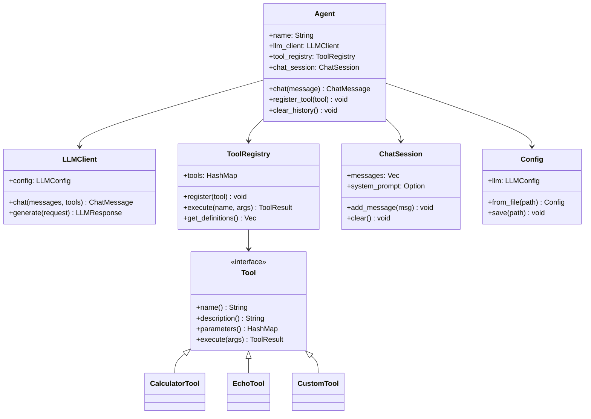

# 🚀 Helios - LLM Agent Framework

[](https://www.rust-lang.org/)
[](LICENSE)

**Helios** is a powerful and flexible Rust framework for building LLM-powered agents with tool support, chat capabilities, and easy configuration management. Create intelligent agents that can interact with users, call tools, and maintain conversation context.

## ✨ Features

- 🤖 **Agent System**: Create multiple agents with different personalities and capabilities
- 🛠️ **Tool Registry**: Extensible tool system for adding custom functionality
- 💬 **Chat Management**: Built-in conversation history and session management
- ⚙️ **Configuration**: TOML-based configuration for LLM settings
- 🔌 **LLM Support**: Compatible with OpenAI API and any OpenAI-compatible API
- 🔄 **Async/Await**: Built on Tokio for high-performance async operations
- 🎯 **Type-Safe**: Leverages Rust's type system for safe and reliable code
- 📦 **Extensible**: Easy to add custom tools and extend functionality

## 📋 Table of Contents

- [Installation](#installation)
- [Quick Start](#quick-start)
  - [Using as a Library Crate](#using-as-a-library-crate)
  - [Using with Agent System](#using-with-agent-system)
- [Configuration](#configuration)
- [Architecture](#architecture)
- [Usage Examples](#usage-examples)
- [Creating Custom Tools](#creating-custom-tools)
- [API Documentation](#api-documentation)
- [Project Structure](#project-structure)
- [Examples](#examples)
- [Contributing](#contributing)
- [License](#license)

## 🔧 Installation

Helios can be used both as a **command-line tool** and as a **library crate** in your Rust projects.

### As a CLI Tool (Recommended for Quick Start)

Install globally using Cargo (once published):

```bash
cargo install helios-engine
```

Then use anywhere:

```bash
# Initialize configuration
helios-engine init

# Start interactive chat
helios-engine chat

# Ask a quick question
helios-engine ask "What is Rust?"

# Get help
helios-engine --help
```

### As a Library Crate

Add Helios to your `Cargo.toml`:

```toml
[dependencies]
helios-engine = "0.1.0"
tokio = { version = "1.35", features = ["full"] }
```

Or use a local path during development:

```toml
[dependencies]
helios = { path = "../helios" }
tokio = { version = "1.35", features = ["full"] }
```

### Build from Source

```bash
git clone https://github.com/yourusername/helios.git
cd helios
cargo build --release

# Install locally
cargo install --path .
```

## 🚀 Quick Start

### Using as a Library Crate

The simplest way to use Helios is to call LLM models directly:

```rust
use helios_engine::{LLMClient, ChatMessage};
use helios_engine::config::LLMConfig;

#[tokio::main]
async fn main() -> helios_engine::Result<()> {
    // Configure the LLM
    let llm_config = LLMConfig {
        model_name: "gpt-3.5-turbo".to_string(),
        base_url: "https://api.openai.com/v1".to_string(),
        api_key: std::env::var("OPENAI_API_KEY").unwrap(),
        temperature: 0.7,
        max_tokens: 2048,
    };

    // Create client
    let client = LLMClient::new(llm_config);

    // Make a call
    let messages = vec![
        ChatMessage::system("You are a helpful assistant."),
        ChatMessage::user("What is the capital of France?"),
    ];

    let response = client.chat(messages, None).await?;
    println!("Response: {}", response.content);

    Ok(())
}
```

**📚 For detailed examples of using Helios as a crate, see [Using as a Crate Guide](docs/USING_AS_CRATE.md)**

### Using with Agent System

For more advanced use cases with tools and persistent conversation:

#### 1. Configure Your LLM

Create a `config.toml` file:

```toml
[llm]
model_name = "gpt-3.5-turbo"
base_url = "https://api.openai.com/v1"
api_key = "your-api-key-here"
temperature = 0.7
max_tokens = 2048
```

#### 2. Create Your First Agent

```rust
use helios_engine::{Agent, Config, CalculatorTool};

#[tokio::main]
async fn main() -> helios_engine::Result<()> {
    // Load configuration
    let config = Config::from_file("config.toml")?;

    // Create an agent with tools
    let mut agent = Agent::builder("HeliosAgent")
        .config(config)
        .system_prompt("You are a helpful AI assistant.")
        .tool(Box::new(CalculatorTool))
        .build()?;

    // Chat with the agent
    let response = agent.chat("What is 15 * 7?").await?;
    println!("Agent: {}", response);

    Ok(())
}
```

#### 3. Run the Interactive Demo

```bash
cargo run
```

## ⚙️ Configuration

Helios uses TOML for configuration. Here's a complete configuration example:

```toml
[llm]
# The model name (e.g., gpt-3.5-turbo, gpt-4, claude-3, etc.)
model_name = "gpt-3.5-turbo"

# Base URL for the API (OpenAI or compatible)
base_url = "https://api.openai.com/v1"

# Your API key
api_key = "sk-..."

# Temperature for response generation (0.0 - 2.0)
temperature = 0.7

# Maximum tokens in response
max_tokens = 2048
```

### Supported LLM Providers

Helios works with any OpenAI-compatible API:

- **OpenAI**: `https://api.openai.com/v1`
- **Azure OpenAI**: `https://your-resource.openai.azure.com/openai/deployments/your-deployment`
- **Local Models (LM Studio)**: `http://localhost:1234/v1`
- **Ollama with OpenAI compatibility**: `http://localhost:11434/v1`
- **Any OpenAI-compatible API**

## 🏗️ Architecture

### System Overview


### Component Architecture



### Agent Execution Flow


### Tool Execution Pipeline


## 📚 Usage Examples

### Basic Chat

```rust
use helios_engine::{Agent, Config};

#[tokio::main]
async fn main() -> helios_engine::Result<()> {
    let config = Config::from_file("config.toml")?;
    
    let mut agent = Agent::builder("Assistant")
        .config(config)
        .system_prompt("You are a helpful assistant.")
        .build()?;
    
    let response = agent.chat("Hello!").await?;
    println!("{}", response);
    
    Ok(())
}
```

### Agent with Built-in Tools

```rust
use helios_engine::{Agent, Config, CalculatorTool, EchoTool};

#[tokio::main]
async fn main() -> helios_engine::Result<()> {
    let config = Config::from_file("config.toml")?;
    
    let mut agent = Agent::builder("ToolAgent")
        .config(config)
        .system_prompt("You have access to tools. Use them wisely.")
        .tool(Box::new(CalculatorTool))
        .tool(Box::new(EchoTool))
        .max_iterations(5)
        .build()?;
    
    // The agent will automatically use the calculator
    let response = agent.chat("What is 123 * 456?").await?;
    println!("{}", response);
    
    Ok(())
}
```

### Multiple Agents

```rust
use helios_engine::{Agent, Config};

#[tokio::main]
async fn main() -> helios_engine::Result<()> {
    let config = Config::from_file("config.toml")?;
    
    let mut poet = Agent::builder("Poet")
        .config(config.clone())
        .system_prompt("You are a creative poet.")
        .build()?;
    
    let mut scientist = Agent::builder("Scientist")
        .config(config)
        .system_prompt("You are a knowledgeable scientist.")
        .build()?;
    
    let poem = poet.chat("Write a haiku about code").await?;
    let fact = scientist.chat("Explain quantum physics").await?;
    
    println!("Poet: {}\n", poem);
    println!("Scientist: {}", fact);
    
    Ok(())
}
```

## 🛠️ Creating Custom Tools

Implement the `Tool` trait to create custom tools:

```rust
use async_trait::async_trait;
use helios_engine::{Tool, ToolParameter, ToolResult};
use serde_json::Value;
use std::collections::HashMap;

struct WeatherTool;

#[async_trait]
impl Tool for WeatherTool {
    fn name(&self) -> &str {
        "get_weather"
    }

    fn description(&self) -> &str {
        "Get the current weather for a location"
    }

    fn parameters(&self) -> HashMap<String, ToolParameter> {
        let mut params = HashMap::new();
        params.insert(
            "location".to_string(),
            ToolParameter {
                param_type: "string".to_string(),
                description: "City name".to_string(),
                required: Some(true),
            },
        );
        params
    }

    async fn execute(&self, args: Value) -> helios_engine::Result<ToolResult> {
        let location = args["location"].as_str().unwrap_or("Unknown");
        
        // Your weather API logic here
        let weather = format!("Weather in {}: Sunny, 72°F", location);
        
        Ok(ToolResult::success(weather))
    }
}

// Use your custom tool
#[tokio::main]
async fn main() -> helios_engine::Result<()> {
    let config = Config::from_file("config.toml")?;
    
    let mut agent = Agent::builder("WeatherAgent")
        .config(config)
        .tool(Box::new(WeatherTool))
        .build()?;
    
    let response = agent.chat("What's the weather in Tokyo?").await?;
    println!("{}", response);
    
    Ok(())
}
```

## 📖 API Documentation

### Core Types

#### `Agent`

The main agent struct that manages conversation and tool execution.

**Methods:**
- `builder(name)` - Create a new agent builder
- `chat(message)` - Send a message and get a response
- `register_tool(tool)` - Add a tool to the agent
- `clear_history()` - Clear conversation history
- `set_system_prompt(prompt)` - Set the system prompt
- `set_max_iterations(max)` - Set maximum tool call iterations

#### `Config`

Configuration management for LLM settings.

**Methods:**
- `from_file(path)` - Load config from TOML file
- `default()` - Create default configuration
- `save(path)` - Save config to file

#### `ToolRegistry`

Manages and executes tools.

**Methods:**
- `new()` - Create empty registry
- `register(tool)` - Register a new tool
- `execute(name, args)` - Execute a tool by name
- `get_definitions()` - Get all tool definitions
- `list_tools()` - List registered tool names

#### `ChatSession`

Manages conversation history.

**Methods:**
- `new()` - Create new session
- `with_system_prompt(prompt)` - Set system prompt
- `add_message(message)` - Add message to history
- `clear()` - Clear all messages

### Built-in Tools

#### `CalculatorTool`

Performs basic arithmetic operations.

**Parameters:**
- `expression` (string, required): Mathematical expression

**Example:**
```rust
agent.tool(Box::new(CalculatorTool));
```

#### `EchoTool`

Echoes back a message.

**Parameters:**
- `message` (string, required): Message to echo

**Example:**
```rust
agent.tool(Box::new(EchoTool));
```

## 📁 Project Structure

```
helios/
├── Cargo.toml              # Project configuration
├── README.md               # This file
├── config.example.toml     # Example configuration
├── .gitignore             # Git ignore rules
│
├── src/
│   ├── lib.rs             # Library entry point
│   ├── main.rs            # Binary entry point (interactive demo)
│   ├── agent.rs           # Agent implementation
│   ├── llm.rs             # LLM client and provider
│   ├── tools.rs           # Tool system and built-in tools
│   ├── chat.rs            # Chat message and session types
│   ├── config.rs          # Configuration management
│   └── error.rs           # Error types
│
├── docs/
│   ├── API.md                    # API reference
│   ├── QUICKSTART.md             # Quick start guide
│   ├── TUTORIAL.md               # Detailed tutorial
│   └── USING_AS_CRATE.md         # Using Helios as a library
│
└── examples/
    ├── basic_chat.rs             # Simple chat example
    ├── agent_with_tools.rs       # Tool usage example
    ├── custom_tool.rs            # Custom tool implementation
    ├── multiple_agents.rs        # Multiple agents example
    └── direct_llm_usage.rs       # Direct LLM client usage
```

### Module Overview

```
helios/
│
├── 📦 agent           - Agent system and builder pattern
├── 🤖 llm             - LLM client and API communication
├── 🛠️ tools           - Tool registry and implementations
├── 💬 chat            - Chat messages and session management
├── ⚙️ config          - TOML configuration loading/saving
└── ❌ error           - Error types and Result alias
```

## 🎯 Examples

Run the included examples:

```bash
# Basic chat
cargo run --example basic_chat

# Agent with tools
cargo run --example agent_with_tools

# Custom tool
cargo run --example custom_tool

# Multiple agents
cargo run --example multiple_agents
```

## 🧪 Testing

Run tests:

```bash
cargo test
```

Run with logging:

```bash
RUST_LOG=debug cargo run
```

## 🔍 Advanced Features

### Custom LLM Providers

Implement the `LLMProvider` trait for custom backends:

```rust
use async_trait::async_trait;
use helios_engine::{LLMProvider, LLMRequest, LLMResponse};

struct CustomProvider;

#[async_trait]
impl LLMProvider for CustomProvider {
    async fn generate(&self, request: LLMRequest) -> helios_engine::Result<LLMResponse> {
        // Your custom implementation
        todo!()
    }
}
```

### Tool Chaining

Agents automatically chain tool calls:

```rust
// The agent can use multiple tools in sequence
let response = agent.chat(
    "Calculate 10 * 5, then echo the result"
).await?;
```

### Conversation Context

Maintain conversation history:

```rust
let mut agent = Agent::new("Assistant", config);

agent.chat("My name is Alice").await?;
agent.chat("What is my name?").await?; // Agent remembers: "Alice"
```

## 🤝 Contributing

Contributions are welcome! Please feel free to submit a Pull Request.

### Development Setup

1. Clone the repository:
```bash
git clone https://github.com/yourusername/helios.git
cd helios
```

2. Build the project:
```bash
cargo build
```

3. Run tests:
```bash
cargo test
```

4. Format code:
```bash
cargo fmt
```

5. Check for issues:
```bash
cargo clippy
```

## 📄 License

This project is licensed under the MIT License - see the LICENSE file for details.

## 🙏 Acknowledgments

- Built with [Tokio](https://tokio.rs/) for async runtime
- Uses [reqwest](https://github.com/seanmonstar/reqwest) for HTTP client
- Configuration with [toml-rs](https://github.com/toml-rs/toml)

## 📞 Support

- 📧 Email: support@helios.dev
- 🐛 Issues: [GitHub Issues](https://github.com/yourusername/helios/issues)
- 💬 Discussions: [GitHub Discussions](https://github.com/yourusername/helios/discussions)

---

Made with ❤️ in Rust
