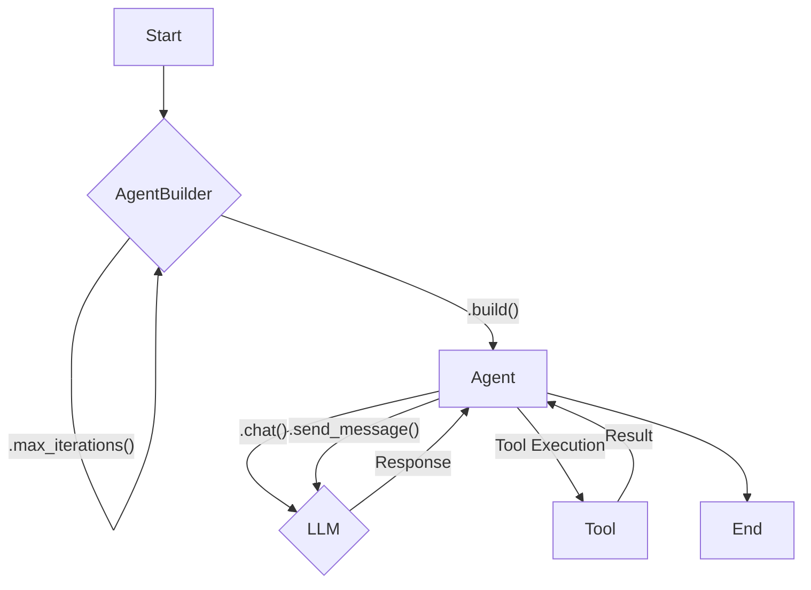

# Agents

At the heart of the Helios Engine is the `Agent`, an autonomous entity that can interact with users, use tools, and manage its own chat history. This chapter will cover the creation, configuration, and core functionalities of agents.

## The `Agent` Struct

The `Agent` struct is the main component of the Helios Engine. It encapsulates all the necessary components for an agent to function, including:

- **`name`**: The name of the agent.
- **`llm_client`**: The client for interacting with the Large Language Model.
- **`tool_registry`**: The registry of tools available to the agent.
- **`chat_session`**: The chat session, which stores the conversation history.
- **`max_iterations`**: The maximum number of iterations for tool execution in a single turn.



## The `AgentBuilder`

The `AgentBuilder` provides a convenient and flexible way to construct and configure agents. It uses the builder pattern to allow you to chain methods together to set the agent's properties.

### Creating an Agent

Here's a basic example of how to create an agent using the `AgentBuilder`:

```rust
use helios_engine::{Agent, Config};

#[tokio::main]
async fn main() -> helios_engine::Result<()> {
    let config = Config::from_file("config.toml")?;

    let mut agent = Agent::builder("MyAgent")
        .config(config)
        .build()
        .await?;

    Ok(())
}
```

### Configuring an Agent

The `AgentBuilder` provides several methods for configuring an agent:

- **`config(config: Config)`**: Sets the configuration for the agent. This is a required method.
- **`system_prompt(prompt: impl Into<String>)`**: Sets the system prompt for the agent. This tells the agent how to behave.
- **`tool(tool: Box<dyn crate::tools::Tool>)`**: Adds a single tool to the agent.
- **`tools(tools: Vec<Box<dyn crate::tools::Tool>>)`**: Adds multiple tools to the agent at once.
- **`max_iterations(max: usize)`**: Sets the maximum number of iterations for tool execution in a single turn.

Here's a more advanced example of how to create and configure an agent:

```rust
use helios_engine::{Agent, Config, CalculatorTool, EchoTool};

#[tokio::main]
async fn main() -> helios_engine::Result<()> {
    let config = Config::from_file("config.toml")?;

    let mut agent = Agent::builder("MyAgent")
        .config(config)
        .system_prompt("You are a helpful assistant.")
        .tools(vec![
            Box::new(CalculatorTool),
            Box::new(EchoTool),
        ])
        .max_iterations(5)
        .build()
        .await?;

    Ok(())
}
```

## Core Functionalities

Once you've created an agent, you can interact with it using the following methods:

- **`chat(message: impl Into<String>)`**: Sends a message to the agent and gets a response.
- **`send_message(message: impl Into<String>)`**: A more explicit way to send a message to the agent.
- **`clear_history()`**: Clears the agent's chat history.
- **`get_session_summary()`**: Returns a summary of the current chat session.

The `Agent` also provides methods for managing its memory, which allows it to store and retrieve information between conversations. You can learn more about this in the [Chat](./chat.md) chapter.
