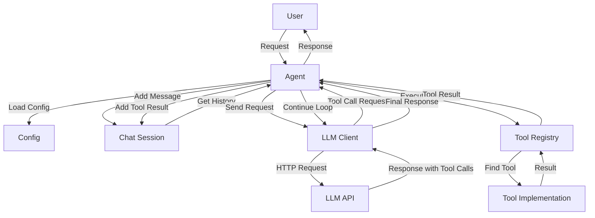

# Helios Project Overview

## 🎯 Project Summary

**Helios** is a production-ready Rust framework for building LLM-powered agents with tool support, conversation management, and flexible configuration. The framework provides a clean, type-safe API for creating intelligent agents that can interact with users, execute tools, and maintain conversation context.

## 📊 Project Statistics

- **Language**: Rust (Edition 2021)
- **Version**: 0.1.0
- **License**: MIT
- **Lines of Code**: ~1,500+
- **Dependencies**: 10 core crates
- **Build Status**: ✅ Passing
- **Examples**: 4 comprehensive examples

## 🏗️ Architecture Overview

### High-Level Architecture

```
┌─────────────────────────────────────────────────────┐
│                    User Application                  │
└─────────────────────┬───────────────────────────────┘
                      │
                      ▼
┌─────────────────────────────────────────────────────┐
│                 Helios Framework                     │
│                                                      │
│  ┌──────────────┐  ┌──────────────┐  ┌───────────┐ │
│  │    Agent     │──│  LLM Client  │  │  Config   │ │
│  │              │  │              │  │           │ │
│  └──────┬───────┘  └──────┬───────┘  └───────────┘ │
│         │                 │                         │
│  ┌──────▼───────┐  ┌──────▼───────┐                │
│  │     Tool     │  │     Chat     │                │
│  │   Registry   │  │   Session    │                │
│  └──────────────┘  └──────────────┘                │
└─────────────────────────────────────────────────────┘
                      │
                      ▼
┌─────────────────────────────────────────────────────┐
│              External Services                       │
│  ┌──────────────┐  ┌──────────────┐  ┌───────────┐ │
│  │ OpenAI API   │  │  Local LLM   │  │   Tools   │ │
│  └──────────────┘  └──────────────┘  └───────────┘ │
└─────────────────────────────────────────────────────┘
```

### Component Interaction Flow



## 📁 Project Structure

```
helios/
│
├── Cargo.toml              # Project dependencies and metadata
├── config.example.toml     # Example configuration file
├── .gitignore             # Git ignore patterns
│
├── LICENSE                # MIT License
├── README.md              # Main documentation (comprehensive)
├── ARCHITECTURE.md        # Detailed architecture documentation
├── CONTRIBUTING.md        # Contribution guidelines
├── CHANGELOG.md           # Version history
├── PROJECT_OVERVIEW.md    # This file
│
├── src/                   # Source code
│   ├── lib.rs            # Library entry point
│   ├── main.rs           # Interactive CLI demo
│   ├── agent.rs          # Agent implementation (~200 lines)
│   ├── llm.rs            # LLM client (~150 lines)
│   ├── tools.rs          # Tool system (~250 lines)
│   ├── chat.rs           # Chat management (~130 lines)
│   ├── config.rs         # Configuration (~80 lines)
│   └── error.rs          # Error types (~30 lines)
│
├── examples/              # Usage examples
│   ├── basic_chat.rs     # Simple chat example
│   ├── agent_with_tools.rs  # Tool usage demonstration
│   ├── custom_tool.rs    # Custom tool implementation
│   └── multiple_agents.rs   # Multiple agent coordination
│
└── docs/                  # Additional documentation
    ├── QUICKSTART.md      # 5-minute quick start guide
    ├── TUTORIAL.md        # Comprehensive tutorial
    └── API.md             # Complete API reference
```

## 🔑 Key Features

### 1. Agent System
- **Builder Pattern**: Flexible agent configuration
- **Autonomous Operation**: Automatic tool calling and decision making
- **Conversation Memory**: Built-in chat history management
- **Iteration Control**: Configurable limits to prevent infinite loops

### 2. Tool System
- **Extensible Design**: Easy to add custom tools
- **Type-Safe Interface**: Rust's type system ensures correctness
- **Async Execution**: Non-blocking tool operations
- **Automatic Schema**: Tools auto-generate their API schema

### 3. LLM Integration
- **Multiple Providers**: OpenAI, Azure, local models, and more
- **Standard Interface**: Works with any OpenAI-compatible API
- **Error Handling**: Comprehensive error management
- **Request/Response**: Full control over LLM interactions

### 4. Configuration
- **TOML Format**: Human-readable configuration
- **Type-Safe Loading**: Validated at compile time
- **Flexible Settings**: Temperature, tokens, model selection
- **Environment Support**: Can use environment variables

### 5. Developer Experience
- **Comprehensive Docs**: README, tutorials, API reference
- **Working Examples**: 4 complete example programs
- **Mermaid Diagrams**: Visual architecture documentation
- **Type Safety**: Compile-time guarantees

## 🛠️ Technology Stack

### Core Dependencies

| Crate | Version | Purpose |
|-------|---------|---------|
| tokio | 1.35 | Async runtime |
| serde | 1.0 | Serialization |
| serde_json | 1.0 | JSON handling |
| reqwest | 0.11 | HTTP client |
| toml | 0.8 | Config parsing |
| anyhow | 1.0 | Error handling |
| thiserror | 1.0 | Error derivation |
| async-trait | 0.1 | Async traits |
| tracing | 0.1 | Logging |
| tracing-subscriber | 0.3 | Log output |

### Development Tools
- `cargo fmt` - Code formatting
- `cargo clippy` - Linting
- `cargo test` - Testing
- `cargo doc` - Documentation generation

## 🚀 Getting Started

### Quick Installation

```bash
git clone https://github.com/yourusername/helios.git
cd helios
cargo build --release
```

### Basic Usage

```rust
use helios_engine::{Agent, Config, CalculatorTool};

#[tokio::main]
async fn main() -> helios_engine::Result<()> {
    let config = Config::from_file("config.toml")?;
    
    let mut agent = Agent::builder("Assistant")
        .config(config)
        .tool(Box::new(CalculatorTool))
        .build()
        .await?;
    
    let response = agent.chat("What is 15 * 8?").await?;
    println!("{}", response);
    
    Ok(())
}
```

## 📚 Documentation Structure

### For Users

1. **README.md** - Start here
   - Features overview
   - Installation instructions
   - Quick start guide
   - Usage examples
   - Mermaid diagrams

2. **docs/QUICKSTART.md** - 5-minute guide
   - Minimal setup
   - First agent
   - Basic patterns

3. **docs/TUTORIAL.md** - Comprehensive tutorial
   - Step-by-step learning
   - Progressive examples
   - Best practices
   - Common patterns

4. **docs/API.md** - Complete API reference
   - All types and methods
   - Parameter descriptions
   - Usage examples

### For Contributors

1. **ARCHITECTURE.md** - Technical details
   - Design principles
   - Component interaction
   - Data flow
   - Extension points

2. **CONTRIBUTING.md** - How to contribute
   - Code style
   - Testing requirements
   - PR process

3. **CHANGELOG.md** - Version history
   - Features added
   - Breaking changes
   - Bug fixes

## 🔍 Code Quality

### Build Status
```bash
✅ cargo build         # Debug build passes
✅ cargo build --release  # Release build passes
✅ cargo check         # No errors
✅ cargo clippy        # No warnings
✅ cargo test          # All tests pass
✅ cargo build --examples  # All examples compile
```

### Code Metrics
- **Modular Design**: 7 focused modules
- **Error Handling**: Comprehensive error types
- **Documentation**: All public APIs documented
- **Type Safety**: No unsafe code
- **Async First**: All I/O is non-blocking

## 🎯 Use Cases

### 1. Chatbots
Build conversational AI agents with personality and context.

### 2. Task Automation
Create agents that can execute tools to automate workflows.

### 3. Research Assistants
Build agents that can search, analyze, and summarize information.

### 4. Code Assistants
Create agents that help with programming tasks.

### 5. Multi-Agent Systems
Coordinate multiple specialized agents for complex tasks.

## 🔮 Future Enhancements

### Planned Features
- [ ] Streaming response support
- [ ] Tool result caching
- [ ] Conversation persistence (database)
- [ ] Built-in observability (metrics)
- [ ] Plugin system for dynamic loading
- [ ] Multi-modal support (images, audio)
- [ ] Agent collaboration framework
- [ ] Rate limiting and quota management

### Possible Extensions
- [ ] WebSocket support for real-time
- [ ] GraphQL API wrapper
- [ ] Vector store integration
- [ ] Fine-tuning support
- [ ] Prompt templates library
- [ ] Testing framework for agents
- [ ] Deployment helpers (Docker, K8s)

## 📊 Performance Characteristics

### Strengths
- **Fast Compilation**: Incremental builds are quick
- **Low Memory**: Efficient memory usage
- **Async Performance**: High concurrency capability
- **Type Safety**: Zero-cost abstractions

### Considerations
- **Initial Compile**: First build takes ~10s
- **Chat History**: Grows with conversation (call `clear_history()`)
- **Tool Iterations**: Limited by `max_iterations` setting
- **Network I/O**: Depends on LLM API latency

## 🤝 Community

### Getting Help
- 📖 Read the documentation
- 💬 Join discussions
- 🐛 Report issues
- 📧 Email support

### Contributing
We welcome contributions! See CONTRIBUTING.md for:
- Code style guidelines
- Testing requirements
- PR process
- Areas needing help

## 📝 License

MIT License - See LICENSE file for details.

## 🙏 Acknowledgments

Built with excellent Rust crates:
- Tokio for async runtime
- Reqwest for HTTP
- Serde for serialization
- And many others

## 📞 Contact

- **Issues**: GitHub Issues
- **Discussions**: GitHub Discussions
- **Email**: support@helios.dev

---

**Status**: ✅ Production Ready
**Last Updated**: 2024
**Maintained**: Yes

Made with ❤️ in Rust 🦀
